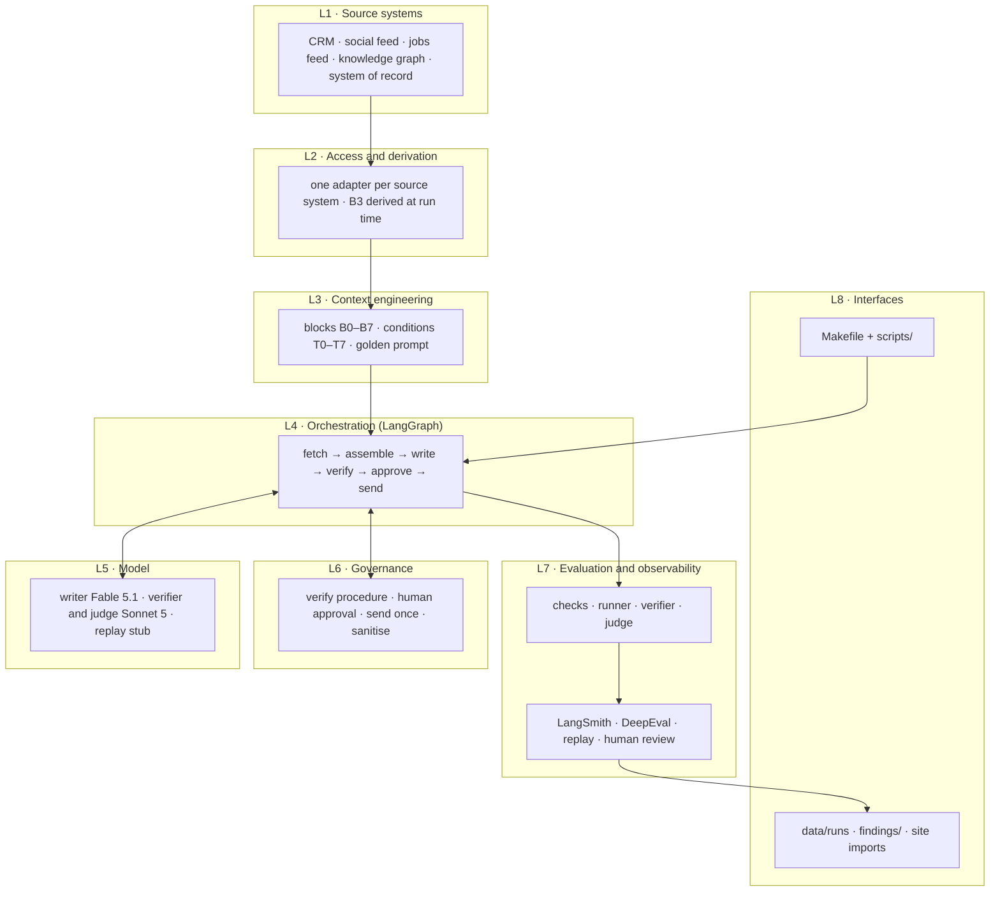
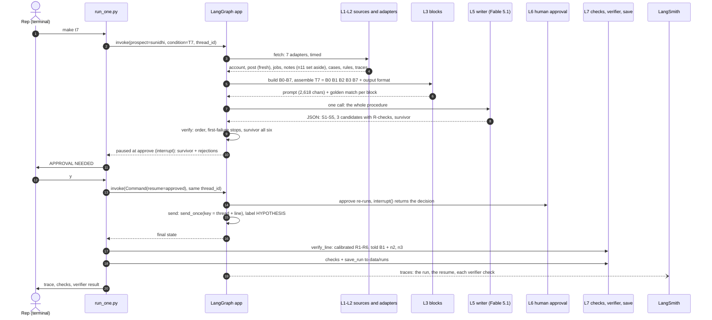
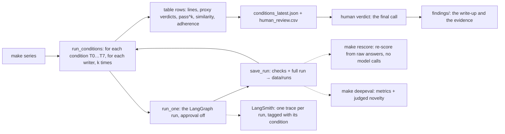
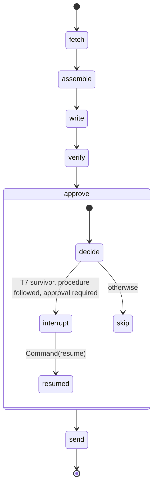

# Sales agent — the T-series runtime (v2)

The developer landing page. Read it once, top to bottom: what the project proves, how to run it, where every
piece lives, how to change it, and how to debug it.

> **Status (28 Sep 2026):** v2 lives on branch `t-series-runtime` and is **not merged to `main`** (per
> `MIGRATION.md`). v1 is kept at tags `kit-v1` and `kit-v1.1-reader-calibration`. First API results:
> `findings/2026-09-26_t_series_api.md`. All data is synthetic.

---

## 1 · What this is

An AI agent that writes **one email subject line that earns the read** for a named sales prospect, and a runtime
that tests one claim:

> Give the model the right **data classes** and the **decision traces** (the 80%) and the model (the 20%) writes the
> line a human expert would write.

The evidence is the **T0–T7 ablation experiment**: the same task given to models, adding one class of data at a
time. Every condition before T7 produced a vendor sentence a competitor could write. **T7** — the decision traces
given as a *procedure* — produced **"3 new states, one payroll run, before your first joiner's salary date"**: a
deadline the prospect had not computed, recombined from her own numbers.

The runtime **rebuilds each condition's prompt automatically from the source systems**, runs the writer model,
checks that it followed the procedure, pauses for a human to approve the send, and records everything — so the
experiment can be re-run on demand, repeated (pass^k), and replayed for students.

**The prospects** (synthetic): **Sunidhi Rao**, VP HR at LogiTrans (expanding into 3 new states, 120 open roles) —
the full case · **Arun Deshpande**, Head of Operations at Sunrise Logistics (3 new depots) · **Nikhil Raman**, CFO at
Steady Freight — the **null case**: nothing is happening, so the right answer is to write nothing.
The seller is **HumanAITech** (payroll and HR platform, multi-state compliance, payroll consolidation, onboarding).

---

## 2 · Architecture: the layers

The runtime is eight layers. Data flows down from the source systems (L1) through access (L2) and context
engineering (L3) into the orchestrator (L4), which calls the model (L5) once and the guards (L6) around it; L7 measures
and records every run, and L8 is how people drive it and read the results.



| Layer | Its job, in one line |
|---|---|
| **L1 · Source systems** | Hold the facts. Files in `data/sources/` stand in for the CRM, the social and jobs feeds, the knowledge graph and the system of record — each a different system in production. |
| **L2 · Access and derivation** | Fetch from each system (timed, one adapter each), apply the 30-day freshness rule, set injection-like notes aside, and compute the derived signals (B3), which have no source of their own. |
| **L3 · Context engineering** | Turn the fetched records into the experiment's blocks B0–B7, and assemble exactly the blocks a condition (T0–T7) defines, in order, with no truncation. Prove the rebuild equals the hand-assembled original (golden prompt). |
| **L4 · Orchestration** | A LangGraph state machine with fixed edges runs one request end to end, carries the state between steps, pauses for the human and resumes. The procedure's order is code, not a model decision. |
| **L5 · Model** | The 20%. One call to the writer per run: a single line (T0–T5) or the whole procedure as JSON (T7). The verifier and the judge are separate models that never write. |
| **L6 · Governance** | Check the writer followed the procedure, stop the send until a human approves, send at most once, keep instruction-like text out of every prompt. |
| **L7 · Evaluation and observability** | Score each run (proxies), repeat runs for pass^k, verify the line independently, trace everything to LangSmith, score saved runs in DeepEval, build the classroom replay, collect the human verdict — which is final. |
| **L8 · Interfaces** | How people use it: `make` targets and scripts in, run files, tables, review sheet and replay out; `findings/` holds what is kept. |

---

## 3 · Components, layer by layer

### L1 · Source systems — `data/sources/`

| Component | Stands in for | Feeds |
|---|---|---|
| `crm_accounts.json` | CRM · account master: prospect, role, company; the seller and what it provides | B0 |
| `social_feed.json` | Social feed: her posts, with age in days and the numbers in them | B1 |
| `jobs_feed.json` | Jobs feed: open roles per company | B1 |
| `crm_notes.json` | CRM · activity notes: dormant private facts, tags, and the `her_experience` flag | B2 · B3 (tags) · the verifier |
| `knowledge_graph/judgement_rules.json` | Knowledge graph: how the best salesperson weighs problems | B4 |
| `knowledge_graph/traces.json` | Knowledge graph: the reader trace R1–R6, the seller trace S1–S5, the task — verbatim | B7 |
| `knowledge_graph/reader_calibrated.json` | Knowledge graph: the verifier's calibrated wording and persona | the verifier only |
| `system_of_record/decision_cases.json` | System of record: past decisions with outcomes and choice sets | B5 |
| `data/experiment/*` | **Reference, not a source**: the hand-assembled blocks, the conditions, the recorded outputs | golden test · conditions · replay stub |

### L2 · Access and derivation — `src/salesagent/sources/`

| Component | What it does |
|---|---|
| `adapters.py` | One function per source system (`crm_account`, `social_post`, `job_postings`, `crm_notes`, `decision_cases`, `judgement`, `traces`, `reader_calibrated`). Each returns `{system, ms, data}` so the replay can show the fetch. `social_post` applies the 30-day freshness rule (no live post → nothing to write); `crm_notes` splits notes into clean and flagged. This file is the seam where real CRM, Neo4j and Postgres plug in. |
| `derive.py` | `signals()` computes B3 — geographic expansion, hiring scale, payroll fragmentation, compliance exposure, onboarding scale, historical interest — from the post, the jobs and the note tags. Deterministic rules, no model. |

### L3 · Context engineering — `src/salesagent/blocks.py`, `data/experiment/conditions.json`

| Component | What it does |
|---|---|
| `fetch_all(prospect)` | Calls every L2 adapter for one prospect. |
| `build(fetched)` | Writes the text of B0, B1, B2, B3, B4, B5, B5a and B7 in the experiment's exact layout. |
| `assemble(blocks, condition)` | Joins exactly the condition's blocks, in order, each under its title, then the task: the shared single-line task for T0–T5b, or the OUTPUT FORMAT block for T7. Returns the prompt and each block's character span. |
| `golden(blocks)` | Compares every rebuilt block with `blocks_verbatim.json` (whitespace normalised). |
| `conditions.json` | The only definition of T0–T7: each condition's blocks and mode (`single` or `procedure`). |

### L4 · Orchestration — `src/salesagent/graph/`

| Component | What it does |
|---|---|
| `spine.py` | `build(checkpointer, store)` compiles a LangGraph `StateGraph` with six nodes and fixed edges. |
| `nodes.py` | The six nodes: `fetch`, `assemble`, `write`, `verify`, `approve`, `send` (§5). |
| `state.py` | `RunState`, the typed dictionary every node reads and returns a partial update to; `trace` is append-only. |
| Checkpointer | `InMemorySaver` (LangGraph) saves the state after each step, keyed by `thread_id`, so a paused run can resume. |

### L5 · Model — `src/salesagent/models.py`

| Component | What it does |
|---|---|
| `chat(name, max_tokens)` | **The only place a real model is built** (Anthropic API via `langchain-anthropic`). Sends `temperature` only to models that accept it. |
| `get_writer(condition, which)` | Writer 1 = `MODEL_WRITER` (Fable 5.1), writer 2 = `MODEL_WRITER_2` (Sonnet 5); 16,000 max tokens. Without a key: `ReplayStub`. |
| `get_reader()` | The verifier's model, `MODEL_READER` (Sonnet 5). None on the stub. |
| `ReplayStub` | Returns the experiment's recorded output for the condition. A recording, not a model; labelled `replay-stub:<condition>`. |
| `text_of` · `extract_line` · `parse_json` · `usage` | Read only the text blocks of an answer (thinking models) · the subject line from a labelled answer · the JSON of a T7 answer · tokens, model and stop reason. |

### L6 · Governance — `graph/nodes.py::verify`, `src/salesagent/guards/`

| Component | What it does |
|---|---|
| `nodes.verify` | For T7, checks the writer's own procedure: 3 candidates, checks in order from R1, stopped at the first failure, `died_at` matches it, the survivor is one of the candidates and passed all six. It does not judge the line. |
| `guards/approval.py` | `request_approval()` calls LangGraph's `interrupt()`: the run pauses with the survivor and the rejections until a human answers. |
| `guards/idempotency.py` | `send_key(thread, line)` and `send_once()`: a resumed run cannot send twice. In memory, or in Postgres when `POSTGRES_URI` is set. |
| `guards/sanitize.py` | Flags instruction-like text ("ignore previous instructions", "write that"). Used by the CRM notes adapter: flagged notes are kept as data and never reach a block. |

### L7 · Evaluation and observability — `src/salesagent/evals/`, `replay.py`

| Component | What it does |
|---|---|
| `checks.py` | Per-run proxies: `verdict_proxy`, `reproduces_experiment`, `known_similarity`, `golden_prompt`, `injection_excluded`, `procedure_adherence` (§9). |
| `runner.py` | `run_one` (build, invoke, resume, save), `run_conditions` (T0→T7 × k × writers), `save_run`, and the table helpers shared with `rescore.py`. |
| `verifier.py` | The independent reader: `known_to_her()` (B1 + her own experiences) and `verify_line()` (the calibrated R1–R6, all six, no break). Evidence, never the gate. |
| `judge.py` | `AnthropicJudge`, DeepEval's judge model for the "Novelty (judged)" metric. |
| `tracing.py` | Turns LangSmith tracing on from `.env`; LangGraph then traces every node and model call. |
| `replay.py` | `build_replay()` → `sales.replay.v1`: eight stops from the query to the line, with the LangSmith trace link. |
| Human review | `data/runs/human_review.csv`, one row per line: the proxy verdict and the human verdict, which is final. |

### L8 · Interfaces — `Makefile`, `scripts/`, outputs

| Component | What it does |
|---|---|
| `run_one.py` | One run of one condition, printed step by step; approval prompt; `--verify`; saves the run. |
| `run_conditions.py` | The T-series: conditions × k × writers → the table and the review sheet. |
| `rescore.py` | Rebuilds the last series from saved raw answers — no model calls. |
| `export_replay.py` · `eval_deepeval.py` · `eval_langsmith.py` · `verify_env.py` | The replay file · DeepEval over saved API runs · a LangSmith experiment · environment checks. |
| `data/runs/` · `findings/` | Every run and table (git-ignored) · what is kept and written up (committed). |

---

## 4 · End-to-end flow

### Scenario A — one request: a subject line for Sunidhi under T7 (`make t7`)



For **T0–T5** the same path stops earlier: `write` returns one line, `verify` has nothing to check, `approve` is
skipped (no survivor) and nothing is sent. For **Nikhil** the post is too old: the run is declined at `fetch` and the
model is never called.

### Scenario B — the experiment: T0→T7, k runs each (`make series`)



---

## 5 · LangGraph at runtime

### The graph

Six nodes, fixed edges, no conditional edges: every run takes the same path. When a step has nothing to do — a
declined prospect, or `verify` on a single-line condition — the node returns an empty update and the run moves on.



### What each node reads and writes

The state is `RunState` (`graph/state.py`). Each node returns only the fields it changes; LangGraph merges them.
`trace` uses an add reducer, so every node's steps append to one list.

| Node | Reads | Writes | Model? |
|---|---|---|---|
| `fetch` | `prospect_id` | `fetch` (per-source summary and ms), `blocks`, `declined` | no |
| `assemble` | `condition_id`, `blocks`, `declined` | `prompt`, `spans`, `golden` | no |
| `write` | `prompt`, `condition_id`, `writer_which` | `raw`, `usage`, `write_ms`; T0–T5: `line`; T7: `seller`, `candidates`, `survivor` | **yes, once** |
| `verify` | `candidates`, `survivor` (T7 only) | `verification` (`adherence`, `issues`, `killed`) | no |
| `approve` | `survivor`, `verification` | `approval` — may **pause** here | human |
| `send` | `approval`, `survivor`, `thread_id` | `sent` (status, key) | no |
| every node | — | `trace` (+ its steps, with timings) | — |

### How a run executes

```python
from langgraph.checkpoint.memory import InMemorySaver
from langgraph.types import Command
from salesagent.graph.spine import build

app = build(checkpointer=InMemorySaver())                   # the checkpointer is what makes pause/resume possible
cfg = {"configurable": {"thread_id": "T7-sunidhi-a1b2c3"},  # one thread = one run's saved state
       "tags": ["T7", "writer1"], "metadata": {"condition": "T7", "prospect": "sunidhi"}}   # shown in LangSmith

out = app.invoke({"prospect_id": "sunidhi", "condition_id": "T7", "writer_which": 1,
                  "thread_id": "T7-sunidhi-a1b2c3", "query": "Write a subject line for sunidhi"}, cfg)
# fetch → assemble → write → verify run; approve calls interrupt(): the run stops, the state is checkpointed,
# and invoke returns with out["__interrupt__"][0].value == {"line": survivor, "rejected": [...]}

out = app.invoke(Command(resume={"approved": True, "by": "rep"}), cfg)
# LangGraph reloads the thread's checkpoint and re-runs approve from its start; this time interrupt() returns
# {"approved": True, ...}; send runs; the graph ends. out is the final state.
```

1. **`invoke` with the input** runs the nodes in order. After each node the checkpointer saves the state under the
   `thread_id`.
2. **At `approve`**, `interrupt(payload)` raises inside LangGraph. The run stops; the payload comes back to the caller
   in `out["__interrupt__"]`. Nothing has been sent — no node before the interrupt has a side effect.
3. **`invoke(Command(resume=…))`** with the same `thread_id` loads the checkpoint and **re-runs `approve` from its
   start**; `interrupt()` now returns the resume value instead of pausing.
4. **`send`** builds the key from thread + line; `send_once` makes a second resume harmless.
5. Each `invoke` is one LangSmith root trace, so a paused run shows as two: the run and the resume.

`evals/runner.py::run_one` does exactly this (approving automatically when `approve=True`) and wraps it in
`collect_runs()` to record the LangSmith run id; `scripts/run_one.py` does the same with a y/N prompt.

### The path each case takes

| Case | fetch | assemble | write | verify | approve | send |
|---|---|---|---|---|---|---|
| **T0–T5b**, Sunidhi | 7 sources | blocks of the condition + single-line task | one line (`extract_line`) | skipped | skipped — no survivor | `not_sent` |
| **T7**, Sunidhi | 7 sources | B0 B1 B2 B3 B7 + output format | the procedure as JSON | procedure checked | **pauses** if the procedure was followed | once, after approval |
| **T7**, procedure broken | 7 sources | as above | JSON, or not JSON | `adherence: false`, issues listed | skipped | `not_sent` |
| **Nikhil** (null case) | no live post → `declined` | no prompt | skipped — model never called | skipped | skipped | `not_sent` |
| Any case with `SEND_APPROVAL_REQUIRED=false` | | | | | no pause; approved only if a survivor followed the procedure | as approved |

---

## 6 · Quick start

```bash
cd ~/fde/sales-agent
./setup_env.sh                 # .venv, packages, .env from .env.example, environment checks. No Docker needed.
source .venv/bin/activate
make test                      # 15 tests on the replay stub — no key, no network, ~1 s
```

Add to `.env` (never committed): `ANTHROPIC_API_KEY=…` and, for tracing, `LANGSMITH_API_KEY=…`. Then:

```bash
make verify                    # 8 checks, incl. one real T7 run on Fable 5.1 (a few cents)
python scripts/run_one.py sunidhi T0      # one run of one condition, printed step by step
make series                    # T0→T7, 3 runs each, on the writer — the headline table
```

**Without an API key** every command still runs: the writer becomes a **replay stub** that returns the
experiment's recorded output. It proves the pipeline, never the model, and every trace says `replay-stub`.

---

## 7 · The data: the 80%

Each block of the prompt comes from a different source system; the orchestrator fetches from each and assembles.

| Block | Class | Source system | File | Built by |
|---|---|---|---|---|
| B0 | Basic — who she is, what we sell | CRM · account master | `crm_accounts.json` | `blocks.build` |
| B1 | Current context — this week | Social feed + Jobs feed | `social_feed.json`, `jobs_feed.json` | `blocks.build` (30-day freshness rule) |
| B2 | Dormant — private facts already held | CRM · activity notes | `crm_notes.json` | `blocks.build` — injection-like notes flagged and excluded |
| B3 | Derived signals | **none — computed at run time** | — | `sources/derive.py`, deterministic rules |
| B4 | Judgement — how the best salesperson weighs it | Knowledge graph | `knowledge_graph/judgement_rules.json` | `blocks.build` |
| B5 | Decision — past cases with outcomes | System of record | `system_of_record/decision_cases.json` | `blocks.build` (B5a = without D4) |
| B7 | Decision traces — the procedure | Knowledge graph | `knowledge_graph/traces.json` | `blocks.build` — the experiment's wording, verbatim |

**The golden-prompt test** (`tests/test_golden_prompt.py`) checks that every block rebuilt from these sources equals
the block a human assembled by hand in the experiment (`blocks_verbatim.json`), whitespace normalised. It passes for
all seven. That is the runtime's central demonstration in one test.

### The conditions

Defined only in `data/experiment/conditions.json` — never in Python.

| Condition | Blocks | Mode |
|---|---|---|
| T0 | B0 | one line |
| T1 | B0 B1 | one line |
| T2 | B0 B1 B2 | one line |
| T3 | B0 B1 B2 B3 | one line |
| T4 | B0 B1 B2 B3 B4 | one line |
| T5 | B0 B1 B2 B3 B4 B5 | one line |
| T5a | B0 B1 B2 B3 B4 B5a | one line — judgement restored, D4 dropped |
| T5b | B0 B1 B2 B3 B5a B4 | one line — as T5a, decision block above judgement |
| **T7** | **B0 B1 B2 B3 B7** | **procedure** — B4 replaced by B7, B5 absent, exactly as the experiment |

T0–T5b share one task sentence (`task_single_line`, reconstructed — the original wording was not preserved). T7's
task is part of B7, verbatim. T7 also gets an OUTPUT FORMAT block after B7 (a runtime addition asking for JSON).

---

## 8 · Commands

| Command | What it does | Model calls |
|---|---|---|
| `make test` | 15 tests on the replay stub | none |
| `make verify` | 8 environment checks; one real T7 on the writer if a key is set | 1 |
| `make series` | T0→T7 on the writer, k=3 → `conditions_latest.json`, `human_review.csv` | 27 |
| `make series2` | T0→T7 on both writers — the T1 identical-sentence check | 54 |
| `make t7` | one full T7 run: approval pause (asks y/N), verifier, run saved | 1 + 6 |
| `make replay` | classroom replay of the latest saved T7 run → `replay_T7.json` | none |
| `make langsmith` | LangSmith experiment over all conditions (+ Nikhil T7) | ~10 |
| `make deepeval` | DeepEval over the saved API runs; `--judge` adds the judged novelty metric | 0 (or 1 per run) |
| `make rescore` | re-score the latest series from its saved raw answers | none |

Scripts, with their options:

```bash
python scripts/run_one.py [prospect] [condition] [--writer 2] [--auto] [--verify]   # default: sunidhi T7
python scripts/run_conditions.py [k] [--only T0,T7] [--two-writers] [--prospect sunidhi]
python scripts/rescore.py                        # after changing extract_line or a check — no API calls
python scripts/export_replay.py [condition] [out.json]
python scripts/eval_deepeval.py [--judge] [--include-stub]
python scripts/eval_langsmith.py [experiment-prefix]
```

`--auto` approves without asking and is labelled `rep (--auto)` in the trace; the send is simulated — nothing leaves
the machine. `run_conditions.py --only T0` rewrites `human_review.csv` with only those rows.

---

## 9 · Models and evaluation

### Three model roles — keep them separate

| Role | Setting | Default | Where |
|---|---|---|---|
| **Writer** — the model under test | `MODEL_WRITER` | `claude-fable-5-1` (T7 parity) | `graph/nodes.py::write` |
| Second writer — cross-model checks | `MODEL_WRITER_2` | `claude-sonnet-5` | `--writer 2`, `make series2` |
| **Verifier** — independent reader, never the gate | `MODEL_READER` | `claude-sonnet-5` | `evals/verifier.py` |
| **Judge** — DeepEval novelty metric | `MODEL_READER` | `claude-sonnet-5` | `evals/judge.py` |

Anthropic API only; `models.chat()` is the only constructor. Newer models reject `temperature` (a 400), so it is sent
only where accepted — there is no temperature 0 on Fable or Sonnet 5, and run-to-run variance is what pass^k measures.
Fable 5.1 always thinks: the writer gets `max_tokens=16000` (billed on use) and only the text blocks of an answer are
read. The stop reason is recorded; `max_tokens` or `refusal` shows in the trace and is kept as data. There is no
automatic model fallback: a refusal is never answered silently by another model inside the experiment.

### Per-run checks (`evals/checks.py`) — proxies; the human verdict is final

| Check | Meaning |
|---|---|
| `verdict_proxy` | INTELLIGENCE if the line carries a deadline clause tied to her event (before/by/ahead of + salary, pay, payroll, joiner, cycle, run, first); else AUTOMATION |
| `reproduces_experiment` | the proxy verdict matches the experiment's for this condition (T4 accepts either — it was unstable) |
| `known_similarity` | token overlap with the known line |
| `golden_prompt` | the assembled blocks equal the experiment's |
| `injection_excluded` | note n11 never reached the prompt |
| `procedure_adherence` | T7: the writer followed the procedure |
| `identical_across_writers` | two writers, same line — the T1 finding (`make series2`) |
| pass^k | `reproduces_experiment` across k repeats |

**The human verdict** goes in `human_review.csv` (column `HUMAN_VERDICT`). It is the final call on every line.

### The independent verifier

`evals/verifier.py` scores a final line against the **calibrated** reader wording
(`knowledge_graph/reader_calibrated.json`), all six checks, no break — evidence, never the gate. It is told only what
she would know: **B1 plus the CRM notes marked `"her_experience": true`** (n2, n3 for Sunidhi) — not the rest of B2,
never flagged notes (`known_to_her()`). The DeepEval judge is told the same.

### Monitoring

- **LangSmith** — set `LANGSMITH_API_KEY`; every run is traced to project `LANGSMITH_PROJECT`
  (`sales-agent-t-series`), tagged with its condition. A run paused for approval appears as two traces (run, resume);
  verifier calls appear as separate traces. `make langsmith` builds dataset `sales-agent-t-series` and an experiment
  per writer. Trace pages show the account owner — check before sharing links with students.
- **DeepEval** — `make deepeval` scores the saved API runs → `data/runs/deepeval_latest.json`. Never set
  `OPENAI_API_KEY`; the judge is Anthropic-backed. Telemetry is off (`DEEPEVAL_TELEMETRY_OPT_OUT=YES`).
- **Replay** — `make replay` writes `sales.replay.v1`: eight stops, query to line — the fetches with timings, the
  assembled prompt with its golden match, the model's run with tokens and latency, the verification, the eval, the
  approval, and the T0→T7 strip. Import it on the sales agent site.

---

## 10 · Configuration (`.env`)

| Variable | Purpose |
|---|---|
| `ANTHROPIC_API_KEY` | empty → the replay stub |
| `MODEL_WRITER`, `MODEL_WRITER_2`, `MODEL_READER` | §9 |
| `STUB_MODEL=1` | force the stub even with a key |
| `SEND_APPROVAL_REQUIRED` | `true` → a T7 survivor pauses for approval |
| `LANGSMITH_API_KEY`, `LANGSMITH_TRACING`, `LANGSMITH_PROJECT` | tracing |
| `DEEPEVAL_TELEMETRY_OPT_OUT=YES` | no usage telemetry |
| `POSTGRES_URI` | optional — durable send-once record across restarts (`docker compose up -d`) |

`.env` is git-ignored. `.env.example` is the template.

---

## 11 · Where outputs go

| Path | Written by | Contents |
|---|---|---|
| `data/runs/<ms>_<cond>_<prospect>_w<n>.json` | every saved run | the full run: blocks, prompt, raw answer, line/candidates, checks, trace, usage |
| `data/runs/conditions_latest.json` | `make series`, `rescore.py` | the conditions table (`sales.conditions.v1`) |
| `data/runs/human_review.csv` | same | one row per line; the human verdict column — kept for unchanged lines when the sheet is rewritten |
| `data/runs/replay_T7.json` | `make replay` | `sales.replay.v1` |
| `data/runs/deepeval_latest.json` | `make deepeval` | every run's metric scores and reasons |
| `findings/` | by hand, committed | write-ups and the evidence copied out of `data/runs` |

`data/runs/` is git-ignored; copy anything worth keeping into `findings/`.

---

## 12 · How to change things

After any change: `make test`. Then one real run to see it: `python scripts/run_one.py sunidhi T0`.

- **A condition's blocks** — edit its entry in `data/experiment/conditions.json`. Never hard-code a condition.
- **The T0–T5 task sentence** — `task_single_line` in the same file; it changes all single-line conditions at once.
- **A block's content** — edit the source file (§7), not the block text. The golden-prompt test will then fail,
  because the block no longer equals the experiment's: expected when the change is deliberate — update
  `blocks_verbatim.json` (or the test) to the new baseline in the same commit, and say so.
- **How a block is laid out** — `blocks.build`; same golden-test rule.
- **The graph** — nodes in `graph/nodes.py`, wiring in `graph/spine.py`, state fields in `graph/state.py`.
  `tests/test_conditions.py::test_spine_order` checks assemble → write → verify → send.
- **The procedure** — `knowledge_graph/traces.json` (what the T7 writer sees, verbatim). The verifier's wording is
  separate: `reader_calibrated.json`. Never swap them.
- **What the verifier knows** — the `her_experience` flag on each note in `crm_notes.json`.
- **A new prospect** — add the account, post, jobs and notes to the source files; no golden reference exists for it.
- **After changing `extract_line` or a check** — `python scripts/rescore.py` re-scores the last series for free.

---

## 13 · Tests

`tests/conftest.py` forces the replay stub, turns tracing off, blanks the LangSmith key and sends runs to a temporary
folder — `make test` never calls a model, never touches the network and never writes into `data/runs`.

| File | Covers |
|---|---|
| `test_golden_prompt.py` | every rebuilt block equals the experiment's · the injection is in no block · B3 is computed, never stored |
| `test_conditions.py` | T7 uses exactly B0 B1 B2 B3 B7 · T7 procedure verified, known line, sent · the series reproduces on replay · Nikhil declines before the model · spine order |
| `test_verify.py` | procedure breaches caught · survivor must pass all six · thinking blocks read as text · subject-line extraction from labelled answers · the verifier knows B1 + n2/n3, not n1/n6/n11 |
| `test_replay.py` | the replay has eight stops · rewriting the review sheet keeps human verdicts |

---

## 14 · Rules that must survive any change

- **Conditions are data** (`conditions.json`). **T7 = B0 + B1 + B2 + B3 + B7** — B4 replaced, B5 absent.
- **No truncation, no token budget** in `assemble`. The experiment had none.
- **The writer receives the experiment's verbatim traces** (`traces.json`); the calibrated wording is the verifier's only.
- **The golden-prompt test stays green**, or its baseline is changed on purpose, in the open.
- **Code verifies the procedure; it does not judge the line.** The verifier never gates. **The human verdict is final.**
- **API models only**; `models.py` builds every model; the stub is a labelled replay.
- **Keep failures**: a T7 run that breaks the procedure, a T0–T5 line that looks intelligent, a judge that disagrees —
  record it in `findings/`.
- **Synthetic data only.**

---

## 15 · Debugging

| Symptom | Look at |
|---|---|
| Golden-prompt test fails | a source file or `blocks.build` changed — diff the block against `blocks_verbatim.json`; whitespace is normalised, words are not |
| A line reads `**Subject line:**` or starts with `Subject:` | `models.extract_line`; then `scripts/rescore.py` |
| T7 output not valid JSON | the writer ignored the output-format block, or stopped at `max_tokens` (see `usage.stop_reason`) — a procedure failure; keep it |
| `procedure_adherence` false | `verification.issues`: out of order, no stop at first failure, died_at mismatch, survivor not all-pass |
| 400 "`temperature` is deprecated for this model" | a model built outside `models.chat()`, or a new model missing from `NO_SAMPLING` |
| `replay-stub` in a trace when you expected the API | `ANTHROPIC_API_KEY` empty or `STUB_MODEL=1` |
| `make test` slow, or calls LangSmith | `tests/conftest.py` missing or edited |
| DeepEval scores stub runs | run without `--include-stub`; tests no longer write to `data/runs` |
| `make replay` shows an old run | `make t7` / `run_one.py` saves its run; replay picks the newest `*_T7_*.json` |
| Nikhil writes a line | freshness rule bypassed — `sources/adapters.py::social_post` |
| n11 in a prompt | `sources/adapters.py::crm_notes` sanitise step |
| T0–T5 look like intelligence on the API | possible — models change. Record it; it weakens the claim, and that matters |

---

## 16 · Decisions and known gaps

**Decisions, 26 Sep (Suchit)** — also in `findings/2026-09-26_t_series_api.md`:
1. Human verdict = the proxy verdict for the first Fable series (T7 intelligence 1/3).
2. The verifier keeps v2's calibrated wording, including the reworded R4 and the Indian-HR-English persona.
3. The verifier (and judge) know B1 plus `her_experience` notes only.
4. No server-side model fallback on the writer.

**Known gaps**
- D5–D7 were in the experiment and are not recoverable; B5 has D1–D4.
- T0–T5 task wording is reconstructed; T7's is verbatim (part of B7).
- The company is LogiTrans, a synthetic stand-in for the placeholder name in the experiment.
- The knowledge graph and system of record are files; `sources/adapters.py` is the seam where Neo4j and Postgres plug in.
- The DeepEval judge scores every Fable line below its 0.7 threshold, including lines the verifier passes on all six — recorded, not tuned.

---

## 17 · History

| Ref | What |
|---|---|
| tag `kit-v1` | the v1 kit as handed over (25 Sep): writer + separate reader, stores, toggle ablation |
| tag `kit-v1.1-reader-calibration` | v1 plus a day of reader calibration — the state before v2 |
| branch `t-series-runtime` | v2: the kit as delivered (commit `5b8173a`, with its original README), then the fixes below |
| branch `main` | v1; v2 merges only after the first API series is recorded (done — awaiting the merge decision) |

Changes to the delivered v2, each its own commit: tests isolated from `.env` (stub, no tracing, temp runs folder) ·
one model constructor, no `temperature` on newer models, thinking blocks read as text, writer `max_tokens` 16000,
stop reason recorded · subject-line extraction from labelled answers + `rescore.py` · the verifier told B1 +
`her_experience` notes only · `run_one.py` saves its run (so the replay shows it) · DeepEval on API runs only, judge
told what the verifier is told, results saved.

Next, from `CLAUDE.md`: `make series2`, `make langsmith`; then durable approval on Postgres, Neo4j/Postgres adapters
behind `sources/adapters.py`, a token-budget experiment, and more prospects.
